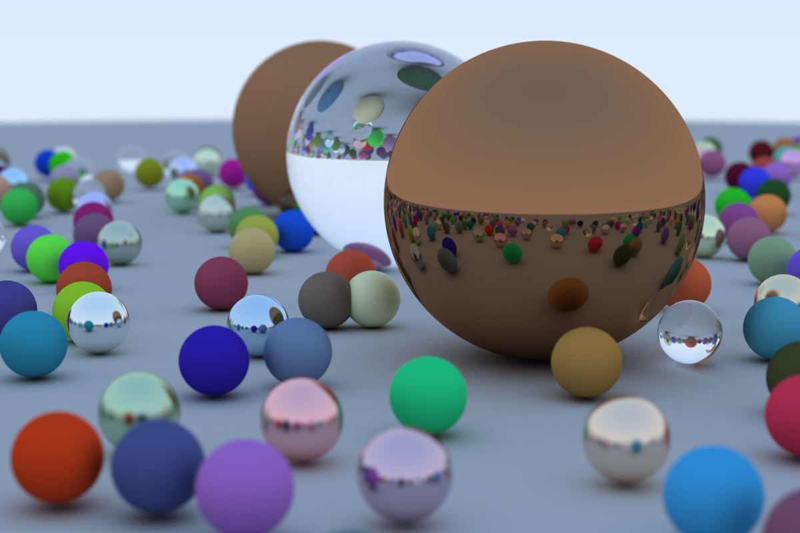

# Ray Tracing in One Weekend (in Rust)

I followed the awesome Tutorial [Ray Tracing in One Weekend](https://raytracing.github.io/books/RayTracingInOneWeekend.html) by [Peter Shirley](https://github.com/petershirley) but used Rust.



## Render an image

If you use [cargo-make](https://github.com/sagiegurari/cargo-make) you can simply do

```
cargo make all
```

otherwise just do

```
cargo run --release > image.ppm
```

## Suggestions

I think Performance could be improved, if you find improvements just let me know.
